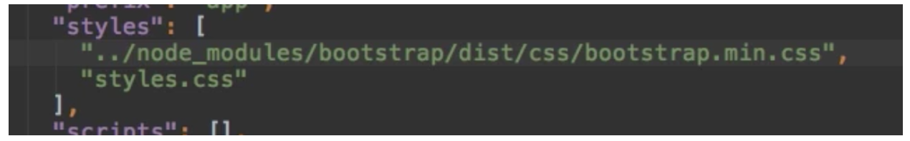
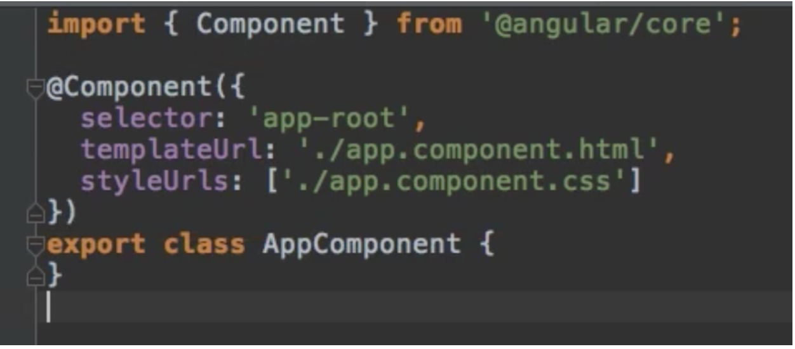
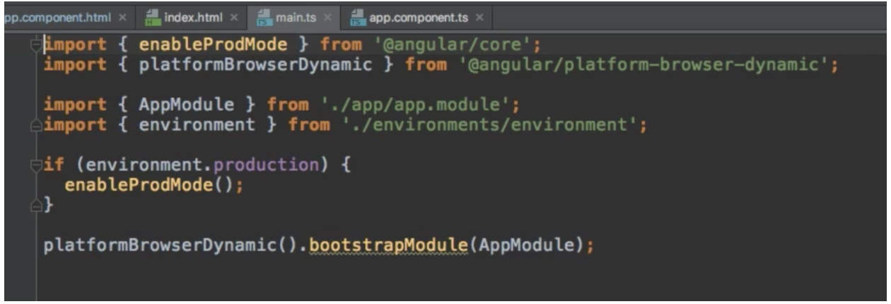
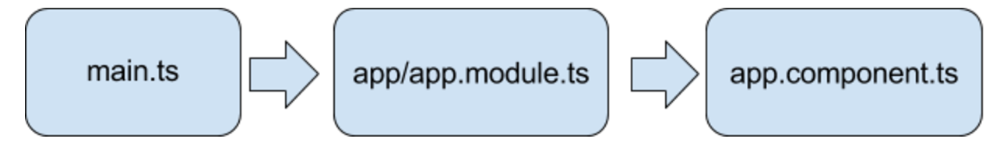

# udemy-angular-notes
https://www.udemy.com/the-complete-guide-to-angular-2
Notes from the above angular 2 course on Udemy.

## 11. A Basic Project Setup using Bootstrap for Styling
You can add libraries (css and js) using NPM.

npm install --save bootstrap


Which will install the library in the node_modules folder in your project, then add the css to the .angular-cli.json file:



## 13. How an Angular App gets Loaded and Started
index.html is served by the server - this is defined in the angular-cli file
There is an <app-root> element  in there by default. An app component can bind to it as follows:



Selector identifies the dom element to be replaced with the content of the component.

Ng serve creates script bundle and chucks them into the index.html file that cause angular to be bootstrapped.
Main.ts is the file which contains the JS / TS that is executed first.
Example:



It loads the app.module file, which in turn declares components to load, imports, etc.

Hence:



## 14. Components are Important!
Components - reusable pieces on a page, ie. a nav bar can be a component, main content can be a component

## 15. Creating a New Component
Generally you place new components under the app directory in the src folder.
Recommends putting components in their own folders

Naming convention:
<component-name>.component.ts

A component is just a TS class. You use decorators (annotations) to enable the angular specific functions. Components need to be imported from packages provided by angular.

Configuration / metadata for components are provided inside these decorators. 

selector: used to identify a dom element to use as the destination - start it with app-, ie. app-server
templateUrl: used to specify a HTML document to use as a template, relative to the TS file
```typescript
  import { Component } from ‘@angular/core’

  @Component({
    selector: ‘app-server’,
    templateUrl: ‘./server.component.html’
  })
  export class ServerComponent {

  }
```

## 16. Understanding the Role of AppModule and Component Declaration
Modules - used to bundle components. Mainly used in bigger applications.

AppModule - default module in an app

@NgModule decorator is used to define properties of the module.

declarations: register components here as an array (need to import the components first - omit the .ts extension on imports)
imports: allows import of other modules. - examples of default ones:
	BrowserModule
	FormsModule
	HttpModule
providers: not sure yet
bootstrap: - array of components to use for index.html (default components)

## 17. Using Custom Components
In the templateUrl file, create a dom element using the selector you defined in the corresponding component.

## 18. Creating Components with the CLI & Nesting Components
While `ng serve` is running

```
  ng generate component <component-name>
  ng g c <component-name>
```

It will create the .ts, .css, .spec and .html files for you, as well as add the imports to the app module. It creates the component in it’s own folder under the app folder.

The Selectors you use in a component can be placed into html files as many times as you like, and an instance of the component will be placed into each.

## 19. Working with Component Templates
Basically says you need one of either template or templateUrl

## 20. Working with Component Styles
Use the styleUrls or styles parameters in @Component argument to specify styles

If using styles, you can use backticks to have line breaks etc accepted by javascript.
```typescript
  styles: [`
    h3 {
        color: dodgerblue;
    }
  `]
```
## 21. Fully Understanding the Component Selector
You can use a subset of CSS selectors to find an element to bind the angular component to.
Classes:  .app-servers
Attributes: [app-servers]
Id tag wont work
Pseudo selectors (hover etc) won’t work

Best practice is to just create your own element and use that in the selector.

Seems to generate warnings if you don’t use app- to start the name of the selector.

## 22. What is Databinding?
Dynamically updated data (from your business logic) reflected in templates.
String interpolation:
	`{{ data }}`
Property binding:
	`[property] = “data”`

Typescript can react to user events via Event Binding 
Two way binding: bind typescript vars to user update of data

```
  [(ngModel)] = “data”
```
  
## 23. String Interpolation

Define vars in your component class:
```
  export class ServerComponent {
      serverId = 10;
      serverStatus: string = ‘offline’;
  }
```
Output it in the template:

```
  <p>Server with ID {{ serverId }} is {{ serverStatus }}</p>
```

Any condition (other than multiline / block expressions) which can be resolved to a string is acceptable inside the curly braces.
Ie: `{{ ‘server’ }}`

Can also return results of a method in the component:

```
  export class ServerComponent {
    serverStatus = 'offline';

    getServerStatus() {
        return this.serverStatus;
    }
  }
```
and in the template:
```
  {{ getServerStatus() }}
```

## 24. Property binding

### Binding to HTML element properties
Example given involves binding a variable to the disabled state of a button.

```
  <button class="btn btn-primary" [disabled]="allowNewServer">Add Server</button>
```

Adding code to the constructor to make the allowNewServer var change and highlight the binding:

```
  allowNewServer = false;
  
  constructor() {
    setTimeout(() => {
      this.allowNewServer = true;
    }, 2000);
  }
```

The binding occurs in the `[disabled]="allowNewServer"` code.

## 25. Property Binding vs String Interpolation

String interpolation:

`{{ allowNewServer }}`

Property binding:

`<p [innerText]="allowNewServer"></p>`

innerText is a property of all elements? It is used to refer to the text inside an element.

String interpolation and property binding cannot be mixed, ie. you can't use string interpolation inside of a property binding.

## 26. Event Binding

Suggests a convention of naming methods that are bound to events in the template as `onXxx()`

IN the template:

`(click)="onCreateServer()"`

where click is an event such as onClock, onMouseEnter etc., and it's value is a method defined in the component (or even define the method inline)

Final product:

```<button class="btn btn-primary" [disabled]="!allowNewServer" (click)="onCreateServer()">Add server</button>```

## 28. Passing and Using Data with Event Binding

input elements can bind to the input event.

```<input (input)="onUpdateServerName($event)"/>```

`$event` is a reserved variable name you can use in a template with event binding. It is the data associated with the triggering event.

COmponent code:

```typescript
onUpdateServerName(event: Event) {
  console.log(event.target.value)
}```

this code will trigger the event on each keystroke that occurs.

Can cast typescript:

```typescript
(<HtmlInputElement>event.target).value
```

## 29. Two-Way-Databinding

There is an easier way of performing event binding, using the `ngModel` directive.

Note: `FormsModule` from `@angular/forms` needs to be imported first in the `AppModule`.

```
  <input [(ngModel)]="serverName"
```

It will update the value of `serverName` in your component automatically, and vice-versa if the variable changes from another source.

## 31. Combining all forms of Databinding

Overview of the types of databinding covered so far.

## Assignment 2 - implementing databinding

app.component.html

```html
  <ol>
    <li>Add a Input field which updates a property ('username') via Two-Way-Binding</li>
    <input [(ngModel)]="username"/>
    <button class="btn btn-primary" [disabled]="isButtonDisabled()" (click)="onResetUsername()" >Reset username</button>
    <p>Username entered is {{ username }}</p>
    <li>Output the username property via String Interpolation (in a paragraph below the input)</li>
    <li>Add a button which may only be clicked if the username is NOT an empty string</li>
    <li>Upon clicking the button, the username should be reset to an empty string</li>
  </ol>
```

app.component.ts

```typescript
  import { Component } from '@angular/core';

  @Component({
    selector: 'app-root',
    templateUrl: './app.component.html',
    styleUrls: ['./app.component.css']
  })
  export class AppComponent {
      username: string = "";

      isButtonDisabled() {
          return this.username.trim().length === 0;
      }

      onResetUsername() {
          this.username = "";
      }
  }

```

## 32. Understanding Directives

Directives are **instructions in the DOM**.

Components are directives with a template.

Example of a directive:

`<p appTurnGreen>Receives a green background</p>`

Can bind to the attribute via a directive selector:

```typescript
@Directive({
  selector: '[appTurnGreen]'
})
export class TurnGreenDirective {
  ...
}
```

## 33. Using ngIf to output data conditionally

`ngIf` works like a regular `if` statement. 
It is a structural directive, hence requires different syntax, and takes an expression as it's value:

```html
<p *ngIf="someBooleanValue">someBooleanValue must be true if you can see this</p>
```

## 34. Enhancing ngIf with an Else Condition

Place a local reference (**#**) on the element, and make the element an ng-template

```
<p *ngIf="serverCreated; else noServer">Server was created, name is {{serverName}}</p>
<ng-template #noServer>
  <p>No server was created!
</ng-template>
```

## 35. Styling Elements Dynamically with ngStyle

Attribute directives

`ngStyle`

Allows you to dynamically add css styles 

Requires configuration to do anything - takes a javascript object as a parameter.

We use property binding to bind a value to the ngStyle directive. 

```
  <p [ngStyle]="{backgroundColor: getColour()}">Blah blah blah</p>
```

## 36. Applying CSS Classes Dynamically with ngClass

Attribute directive:

`ngClass`

Allows you to dynamically add or remove css classes. Also requires property binding.
Takes a property which is a javascript object, of key-values which are:

key: the css class
value: the condition under which it will apply

```
  <p [ngClass]="{online: server-status === 'online'}">Blah blah blah</p>
```

## 37. Outputting Lists with ngFor

ngFor

It is another structural directive - hence the need to prefix an *.

```
  <app-server *ngFor="let server of servers"></app-server>
```

Where `server` represents an item in the servers array.

## 38. Getting the Index when using ngFor

Use `index` (in a reserved keyword sense) in the ngFor definition.

`*ngFor="let logItem of log; let i = index"`

`i` will now be available to use in conditional statements.


### 39. Project discussion
## 40. Planning an app

Splitting an app up into features, and then components.

### Components
- Root component
- Header component

#### Shopping list
- Shopping List
- Shopping list edit

#### Recipe book (limited to displaying, no editing)
- Recipe containing:
- Recipe List
- Recipe Item

- Recipe Detail

### Model items
#### Shopping list
- Ingredient

#### Recipe book
- Recipe

## 41. Setting up the application
ng new projectname
npm install --save bootstrap

add bootstrap to the .angular-cli.json file under the apps.styles property:

```json
"styles": [
  "../node_modules/bootstrap/dist/css/bootstrap.min.css",
  "styles.css"
],
      ```
Discusses the use of Emmet - Using tab to autocomplete to knock up html quickly

ie.

`div.container>.row>p`

pressing tab would then create associated HTML dom

## 42. Creating the components

Nested components (with spec disabled):

`ng g c recipes --spec false`

`ng g c recipes/recipe-list --spec false`

## 43. Using the components

Just adding html content to the components - nothing more than that.

## 44. Adding a navigation bar

More HTML - header nav based on bootstrap.

## 46. Creating a recipe model 

Just a TS class:

```typescript
export class Recipe {
  public name: string;
  public description: string;
  public imagePath: string;

  constructor(name: string, description: string, imagePath: string) {
    this.name = name;
    this.description = description;
    this.imagePath = imagePath;
  }
}
```

## 47. Adding content to the recipes component

Using instance of the recipe class as an array

`import { Recipe } from '../recipe.model';`

`...`

`recipes: Recipe[] = [];`

Populated the HTML with an ngFor where required to show the recipe on the page.

## 48. Outputting a List of Recipes with ngFor

for the img src, you have two options:

String interpolation: `src="{{ recipe.imagePath }}`

or

Property binding: `[src]="recipe.imagePath"`


## 49, 50

Same stuff -- only HTML changes

## 51. Creating Ingredient model

Creating data objects without verbosity - add visibility modifiers to the constructor params.

```typescript
export class Ingredient {

  constructor(public name: string, public amount: number) {
  }
}
```

## 52. Creating and Outputting the Shopping List

Add ngFor to the ul in shopping-list and populate ingredient details.

## 53, 54. Adding a Shopping List Edit Section and wrapping up the HTML stuff

.. HTML edits

# Section 4 - Debugging
## 55. Understanding Angular Error Messages
Straight-forward example of debugging stack trace in the browser console.

## 56. Debugging code in the browser using source maps

With enableProdMode() not called, you're in development mode. You get access to source maps in this mode.

Putting break points in the compiled js in the browser console will jump you to the associated ts file source.

Source TS is available at runtime in the browser under the sources path webpack/./src/app/

## 57. Using Augury to Dive into Angular Apps

A chrome dev tools extension that helps you debug angular apps.

Gives you visibility of the loaded components and their properties at runtime, as well as injection graphs etc.

# Section 5. Understanding Components and Databinding

## 59. Splitting Apps into Components

